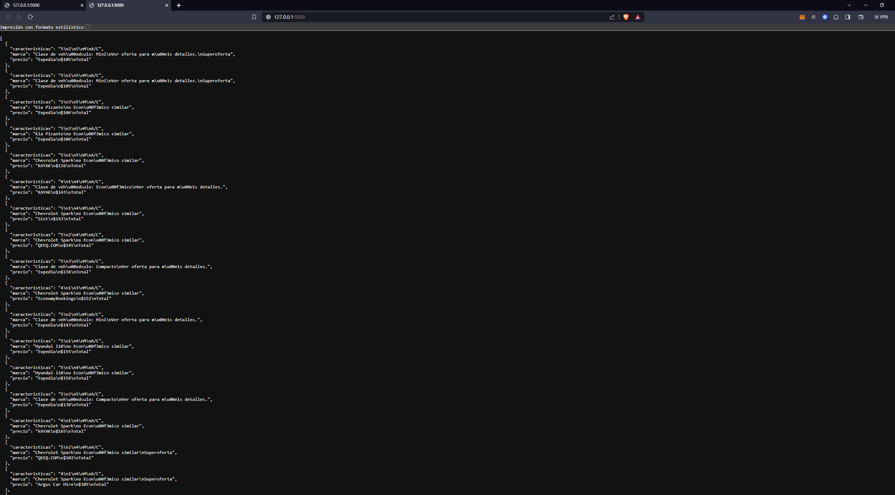

# Parte 2 Examen final#
Buenas ing. decidí hacer sobre la página kayak, en la parte de renta de autos acá en quito, no tiene una API como tal 
así que lo realicé con Selenium, donde extraje datos como: Marca, precio y características del auto como: número de 
pasajero, equipaje, numero de puertas entre otros.

Se me genero dificultad un poco en la parte 3, como no tenía una API fue un poco complicado, el cual investigue 
como hacerle hasta sacarle, le utilice el FLASK.

A continuacion comparto la captura de la parte 3, Crear un servicio web (usando Python + Flask o Django) que 
acceda a esa base de datos y haga algo (puede ser simplemente un print) o algo más elaborado como un buscador web.

Gracias. Saludos cordiales.
